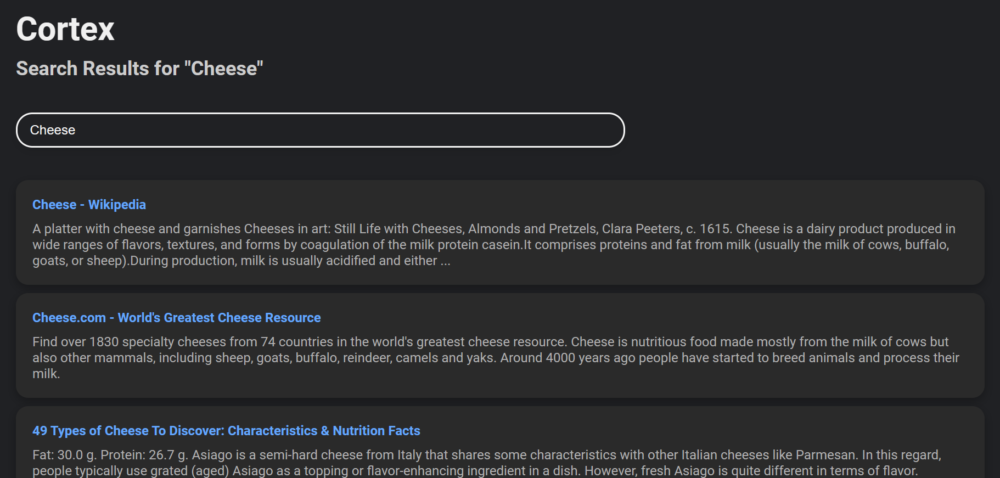

<p align="center">
    <h1 align="center">Cortex - Search Engine</h1>
</p>

Cortex is a **fast** and **lightweight**, Express-based search engine web application.

<p align="center">
    
</p>
<p align="center">
    
</p>


## 📚 Table of Contents

- [🌟 Features](#features)
- [🔧 Installation](#installation)
- [🚀 Usage](#usage)
- [🤝 Contribute](#contribute)
- [📜 License](#license)
- [🙏 Acknowledgements](#acknowledgements)


## 🌟 Features

- 🏎️ **Lightweight and Fast**: Built on Express.js, Cortex ensures minimal overhead and top-notch performance.
- 📱 **Responsive Design**: Adaptable design guarantees an optimal experience across devices.
- 🔍 **Search with Ease**: The intuitive user interface ensures you get accurate results in seconds.


## 🔧 Installation

1. **Clone the Repository**:

   ```bash
   git clone https://github.com/DarkTwentyFive/Cortex.git
    ```
2. **Navigate to the Directory**:

    ```bash
    cd Cortex
    ```
3. **Install Dependencies**:

    ```bash
    npm install
    ```


## 🚀 Usage
1. **Start the Server**:

    ```bash
    npm start
    ```
2. **Access the Web Application**: Open your favorite browser and head to:

    ```
    http://localhost:3000
    ```
3. **Search**: Input your queries in the search bar and hit enter. Voila! Your results are right there.

# 🤝 Contribute

💡 Contributions enlighten the project! If you'd like to pitch in, kindly fork the repository, make your brilliant changes, and submit a pull request. All contributions are heartily appreciated.

# 📜 License

Distributed under the MIT License. See the [LICENSE](LICENSE) file for more information.

# 🙏 Acknowledgements

- A huge shoutout to DuckDuckGo API for their invaluable free-to-use search API.
- Kudos to the Express.js community for such a great web server framework.
- A hearty thanks to everyone who has provided feedback and suggestions.

<p align="center">
    <strong>Happy Searching with Cortex! 🚀</strong>
</p>